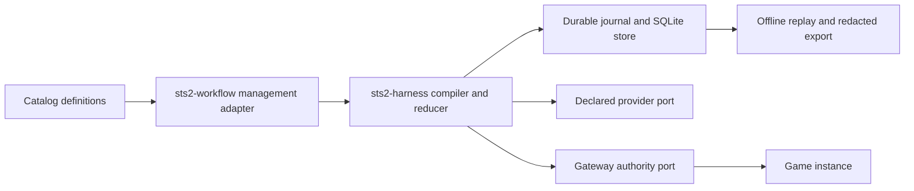

# Phase 1 architecture

The delivery repository supplies definitions, capability manifests and process
cases. The harness decodes and validates a definition, computes its semantic
digest, compiles one immutable graph, and advances the reducer through bounded
steps. Dynamic regions can produce only registered analysis/decision topology;
mutation still returns to the fixed outer action boundary.

The journal is authoritative. Telemetry and exported evidence are bounded
projections. A provider or gateway outage cannot erase an intent already
committed to the journal. An uncertain external effect stays unresolved until a
declared authority port supplies correlated evidence.

The current delivery process profile is synthetic and loopback-only. It has no
native game, provider credential, remote bind or deployment behavior.
